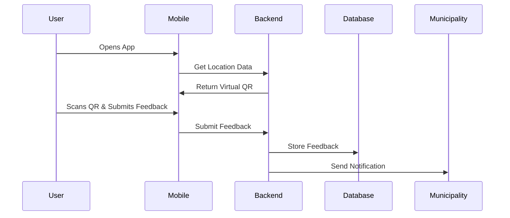
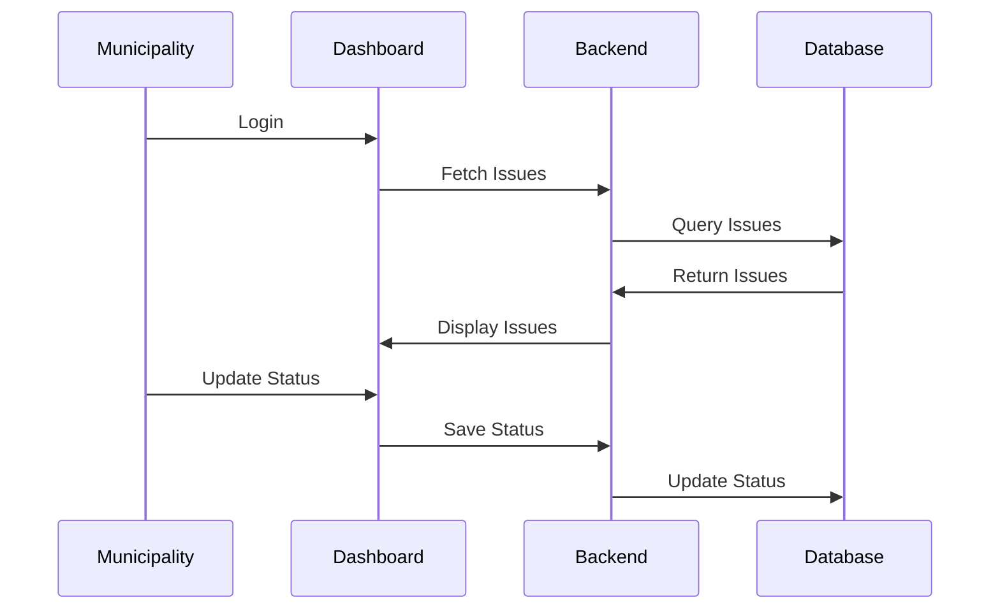

# System Architecture

## Overview
The Municipal AR Feedback System consists of three main components:
1. Mobile Application (React Native + Expo)
2. Backend Services (Node.js)
3. Municipality Dashboard (Next.js)

## Architecture Diagram
```
┌─────────────────┐     ┌──────────────┐     ┌─────────────────┐
│   Mobile App    │     │   Backend    │     │    Dashboard    │
│  (React Native) │◄───►│   (Node.js)  │◄───►│    (Next.js)    │
└─────────────────┘     └──────────────┘     └─────────────────┘
        ▲                      ▲                      ▲
        │                      │                      │
        ▼                      ▼                      ▼
┌─────────────────┐     ┌──────────────┐     ┌─────────────────┐
│    ViroReact    │     │  PostgreSQL  │     │     Redis       │
│      (AR)       │     │   (Data)     │     │   (Cache)       │
└─────────────────┘     └──────────────┘     └─────────────────┘
```

## Component Details

### 1. Mobile Application
- **Framework**: React Native with Expo
- **Key Features**:
  - AR-based QR code scanning
  - Location services
  - Offline support
  - Push notifications
  - Image upload
  - Form submissions

### 2. Backend Services
- **Framework**: Node.js with Express
- **Services**:
  - Authentication Service
  - Feedback Service
  - Municipality Service
  - Location Service
  - Notification Service
  - File Storage Service

### 3. Municipality Dashboard
- **Framework**: Next.js
- **Features**:
  - Real-time analytics
  - Issue management
  - User management
  - Payment processing
  - Report generation

## Data Flow

### 1. User Feedback Submission


### 2. Municipality Issue Management


## Security

### Authentication
- JWT-based authentication
- Refresh token rotation
- Role-based access control

### Data Protection
- End-to-end encryption
- Secure file uploads
- Rate limiting
- Input validation

## Scalability

### Horizontal Scaling
- Containerized services
- Load balancing
- Database replication

### Performance
- Redis caching
- CDN integration
- Query optimization
- Background job processing

## Monitoring

### System Health
- Application metrics
- Error tracking
- Performance monitoring
- Resource utilization

### Business Metrics
- User engagement
- Issue resolution time
- Municipality adoption
- System usage 